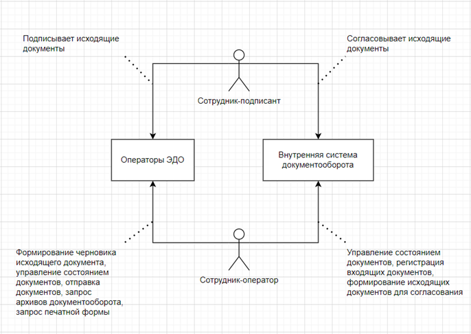
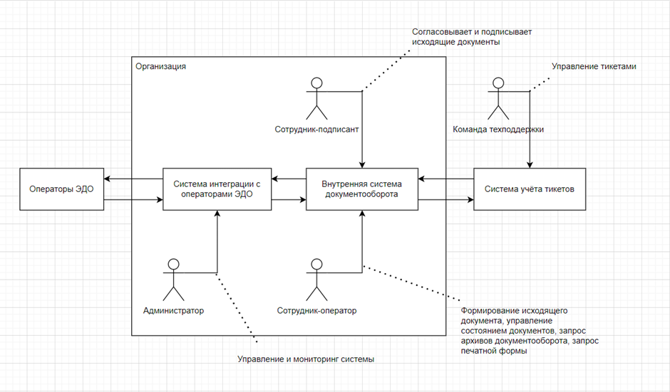
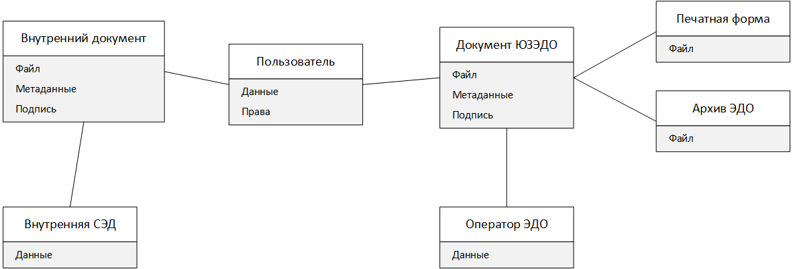
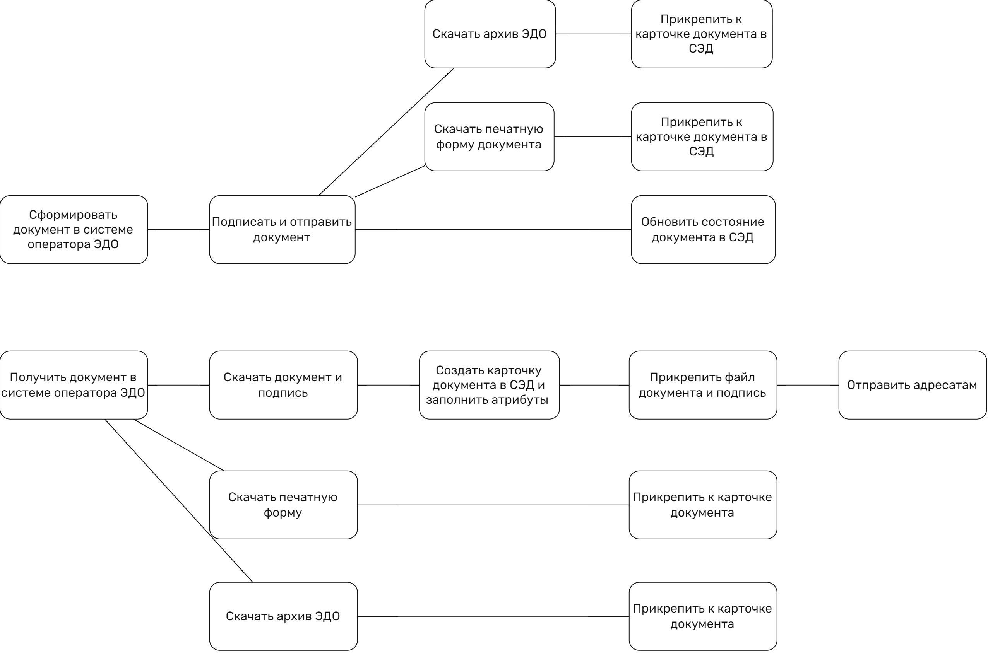
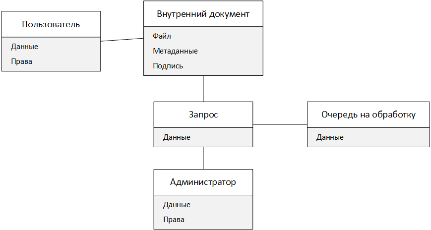
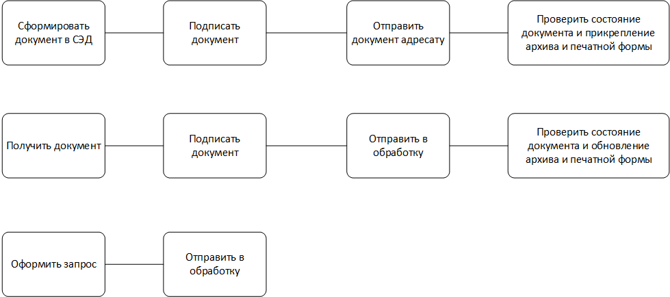
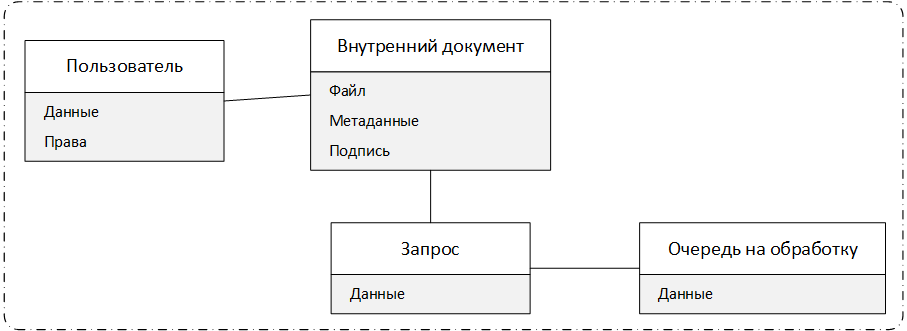
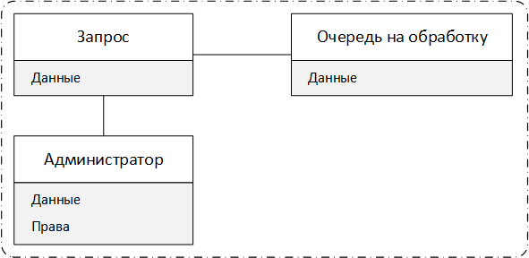

# Анализ задач и поиск архитектурного решения для проекта интеграции системы документооборота заказчика с операторами ЭДО

## Бизнес-контекст

У заказчика есть внутренняя система документооборота. Система обслуживает и связывает географически разнесённые филиалы. Пользователями являются тысячи сотрудников. Так же заказчик осуществляет документооборот со своими контрагентами через несколько существующих операторов ЭДО.
## Контекстная схема системы

Текущая архитектура взаимодействия с операторами ЭДО.

## Бизнес-цели

Автоматизировать деятельность по документообороту с контрагентами в рамках существующей внутренней системы документооборота путём разработки новой высокопроизводительной системы, позволяющей сократить издержки существующей корреспонденции с контрагентами.
## Бизнес-драйверы

- на осуществление документооборота с контрагентами тратится много времени;
- данные по контрагентам обновляются слишком медленно во внутренней системе документооборота;
- данные по договорам не всегда актуальны во внутренней системе документооборота.
## Стейкхолдеры и их потребности

- Администратор – управляет работой интеграции, имеет доступ к логам и формирует запрос в службу техподдержки;
- Сотрудник-подписант – подписывает исходящие документы выданным ему сертификатом как представитель компании;
- Сотрудник-оператор – получает входящую корреспонденцию, изменяет состояние входящих и исходящих документов в зависимости от бизнес-процесса, формирует исходящий документ;
- Команда техподдержки – принимает обратную связь от администраторов в виде логов и сообщения о работе системы, от пользователей в виде сообщений об ошибках;
## Пользовательские истории

1. Как автор документа, 
   пользователь хочет иметь возможность регистрировать документ и отправлять на подпись, 
   чтобы получатель автоматически получал подписанный документ.
2. Как автор документа, 
   пользователь хочет видеть текущее состояние исходящего документа, 
   чтобы знать реакцию получателя на полученный документ.
3. Как подписант исходящего документа, 
   пользователь хочет отправить с документом свою подпись, 
   чтобы получатель документа могу удостовериться в подписании полученного документа.
4. Как получатель документа, 
   пользователь хочет иметь в системе ЭДО доступ к входящему документу сразу же после его отправки, 
   чтобы иметь возможность своевременно отреагировать на документ.
5. Как подписант входящего документа,
   пользователь хочет отправить изменение состояния документа с подписью к нему, 
   чтобы отправитель получил реакцию получателя на документ.
6. Как автор документа (или получатель), 
   пользователь хочет видеть рядом с исходящим (или входящим) документом полный архив документооборота от оператора ЭДО, 
   чтобы видеть историю изменения состояния документа, иметь доступ к квитанциям и подписям.
7. Как автор документа (или получатель), 
   пользователь хочет видеть рядом с исходящим (или входящим) документом печатную форму, 
   чтобы иметь возможность быстро распечатать образ документа со штампами, содержащими состояние документа.
## Атрибуты качества (и не функциональные требования)

- Сервисы и база данных должны быть высокодоступными, т.к. для бизнеса критична быстрая реакция на изменения в процессе документооборота с контрагентами;
- Время регистрации входящих документов должно составлять несколько секунд;
- Время отправки исходящих документов должно составлять несколько секунд;
- Время изменения состояния документа не больше 3 секунд;
- Сервисы должны быть отказоустойчивые, чтобы обеспечивать беспрерывный поток документооборота;
- Логи должны быть легкодоступны, физически разделены по сервисам и содержать удобочитаемую информацию;
- Управление сервисами должно осуществляться инструментами операционной системы;
- В системе не должно быть пропущенных тикетов.
## Критические сценарии

- Сотрудник-оператор изменяет состояние документа в система оператора ЭДО через систему внутреннего документооборота организации;
- Сотрудник-оператор отправляет документ в систему оператора ЭДО через систему внутреннего документооборота организации;
- Сотрудник-оператор получает документ из системы оператора ЭДО в системе внутреннего документооборота организации;
- Сотрудник-подписант подписывает исходящие из внутренней системы документооборота организации документы в этой же системе;
## Критические характеристики

- Регистрация одного входящего документа – 95% квантиль не должен превышать 10 секунд;
- Отправка исходящего документа – 95% квантиль не должен превышать 10 секунд;
- Изменение состояния документа – 95% квантиль не должен превышать 3 секунд;
- Надёжность – не должно быть потерянных входящих и исходящих документов, изменений состояний документов;
- Up-time в будние дни должен быть 99,9%, в выходные дни и праздники 95%;
- Доступность 99,96% - допускается недоступность 1 час в неделю;
- Время разработки: …
- Стоимость: …
## Архитектурные решения

[Описание решений в виде ADR](Учёба/Архитектура/Software%20Architect/Итоговый%20проект/ADR.md)

В качестве итогового решения выбрана микросервисная архитектура, т.к. предполагается, что потребуется масштабирование из-за планируемого увеличения штата сотрудников.
## Архитектура выбранного решения

## Декомпозиция 
### Предметная область as is

### Функциональная декомпозиция as is

### Предметная область to be

### Функциональная декомпозиция to be

### Сценарии изменений

- администратор может создать запрос на: 
	- повторное получение архива;
	- повторное получение печатной формы документа;
	- повторную отправку документа;
	- обработку события оператора.
- пользователь может зарегистрировать документ и отправить его;
- пользователь может создать запрос на:
	- подписание входящего документа;
	- отказ в подписании входящего документа;
	- запрос аннулирования;
	- отказ в запросе аннулирования.
### Решение в срезе сущностей

Выделено 5 сущностей: пользователь (П), запрос (З), внутренний документ (Д), очередь на обработку (О), администратор (А)

#### Оценка стоимости изменений

- администратор может создать запрос на:
	- повторное получение архива (А, З, О);
	- повторное получение печатной формы документа (А, З, О);
	- повторную отправку документа (А, З, О);
	- обработку события оператора (А, З, О).
- пользователь может зарегистрировать документ и отправить его (П, Д, З, О);
- пользователь может создать запрос на:
	- подписание входящего документа (П, Д, З, О);
	- отказ в подписании входящего документа (П, Д, З, О);
	- запрос аннулирования (П, З, О);
	- отказ в запросе аннулирования (П, З, О).
### Решение в срезе ограниченных контекстов

Выделено 2 контекста:
#### Контекст пользователя (КП)

#### Контекст администратора (КА)

#### Оценка стоимости изменений

- администратор может создать запрос на: 
	- повторное получение архива (КА, КП);
	- повторное получение печатной формы документа (КА, КП);
	- повторную отправку документа (КА, КП);
	- обработку события оператора (КА, КП).
- пользователь может зарегистрировать документ и отправить его (КА, КП);
- пользователь может создать запрос на:
	- подписание входящего документа (КА, КП);
	- отказ в подписании входящего документа (КА, КП);
	- запрос аннулирования (КА, КП);
	- отказ в запросе аннулирования (КА, КП).
### Сравнительный анализ

Оба способа практически идентичны по затратам. 
### Вывод

Если в документе сосредоточится большая часть логики, то предпочтительнее вариант 1.
## Диаграмма последовательности

## Оценка атрибутов качества
### Надёжность
Сервис интеграции использует БД для сохранения событий и состояний обрабатываемых объектов. Это позволяет продолжить обработку начиная с момента отказа или, в случае перезапуска сервиса, с последнего сохранённого события. Предусмотрено ручное управление обработкой определённых событий и документов, т.е. в случае, когда происходит отказ на моменте обработке события и автоматическая повторная обработка не производится, можно через интерфейс взаимодействия с сервисом разместить нужный запрос в очереди на обработку.
### Масштабируемость
Для сервиса интеграции доступно горизонтальное масштабирование в виде репликации БД Master-Slave и развёртывания дополнительных экземпляров микросервисов. 
### Отказоустойчивость
Структура БД позволяет запустить несколько экземпляров сервиса и за счёт очередей на обработку распределить между ними нагрузку. Это позволит обеспечить бесперебойную работу интеграции. 
### Сопровождаемость
Сервис реализован на стеке технологий, полностью поддерживаемом группой разработки. Для проведения тестирования изменений в сервисе используются юнит-тесты.
### Производительность
Сервис использует событийную модель, что позволяет сократить до нескольких секунд временной лаг между наступлением события у оператора ЭДО и его фиксацией на стороне системы. 
### Модифицируемость
Архитектура сервиса представляет собой микросервисную архитектуру, где сервисы общаются между собой через брокер сообщений. При сохранении формата сообщений изменения одного сервиса не затрагивают другие. 

## Диаграмма контейнеров приложения на основе выбранной модели функциональной декомпозиции

### Обработка входящего события

### Обработка системного запроса 

## Декомпозиция слоя данных

## Диаграмма деплоя

Средой развёртывания выбран k8s, т.к. оптимален для микросервисов, позволяет обеспечить автоматическое масштабирование и отказоустойчивость, оркестрирует контейнеры приложений.

